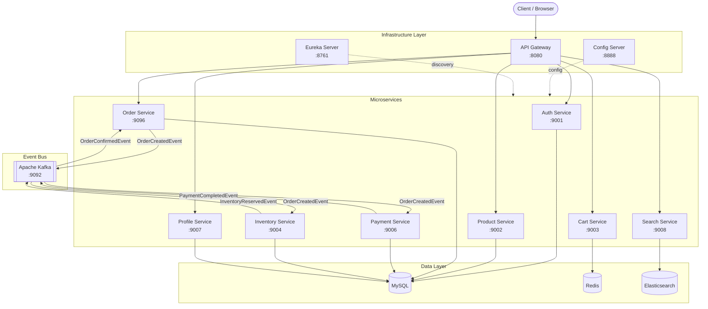
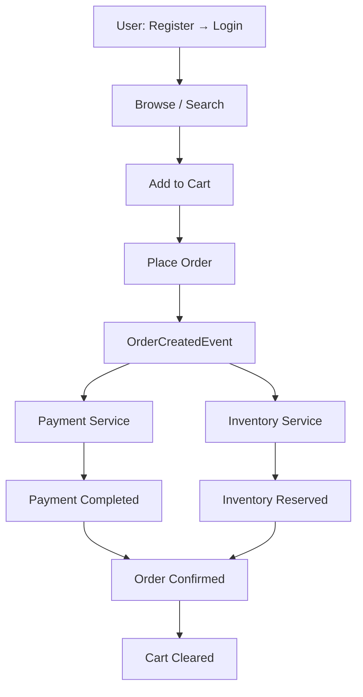

# 🛒 E-Commerce Microservices System

<p align="center">
  <b>Scalable • Event-Driven • Distributed • Production-Grade</b>
</p>

<p align="center">
  
  
  
  
  
  
</p>

##  Overview

- A cloud-native e-commerce platform built using Spring Boot microservices, featuring product management, order processing, search, AI-powered recommendations, and centralized configuration.
- Designed with industry-standard patterns such as service discovery, API gateway, event-driven communication, fault tolerance, and scalable distributed architecture.
---

##  Architecture Overview

> This architecture reflects how large-scale distributed systems operate in production.

##  Core Architectural Principles

- **Microservices Architecture** (database-per-service pattern)  
- **Event-Driven Communication** via Apache Kafka  
- **Distributed Transactions** using Saga (Choreography)  
- **Service Discovery** with Netflix Eureka  
- **API Gateway** for centralized routing & security  
- **JWT-based Authentication & Authorization**  
- **Search Service** powered by Elasticsearch with Redis support
- **AI Integration** for intelligent product search and recommendations   
- **Hybrid Communication** (Async via Kafka + Sync REST where required)


---

##  AI-Powered Features

The platform includes a dedicated AI Service that enhances product discovery and user experience through intelligent search and recommendations.

### Capabilities

- Semantic Product Search
- AI-Powered Product Recommendations
- Retrieval-Augmented Generation (RAG)
- MCP-Based Tool Integration
- Natural Language Product Discovery

### AI Stack

- Spring AI
- Large Language Models (LLMs)
- Elasticsearch
- RAG (Retrieval-Augmented Generation)
- MCP (Model Context Protocol)

---

##  Architecture & Tech Stack
This project is a distributed, event-driven e-commerce backend system built using:

###  Architectural Style
- Microservices Architecture  
- Event-Driven Architecture  

###  Core Technologies

- Spring Boot  
- Spring Cloud  
- Apache Kafka  
- MySQL  
- Redis  
- Elasticsearch  
- JPA / Hibernate  
- OpenFeign  
- JWT Authentication  
- RAG (Retrieval-Augmented Generation)  
- MCP (Model Context Protocol)  
- AI / LLM Integration  

###  Distributed System Patterns
- Saga Pattern (Orchestration)  
- Outbox Pattern  
- Inbox Pattern  
- Idempotent Processing  



  

---

##  What This Project Actually Solves

This is **not just an order system** — it addresses real-world distributed system challenges:

-  Distributed transaction management  
-  Event-driven consistency  
-  Idempotent processing  
-  Reliable event publishing  
-  Duplicate message handling  
-  Order orchestration
-  AI-powered semantic product search and recommendations  
-  Data integrity across services  
-  Eventually consistent architecture
-  Fault tolerance with Resilience4j (Circuit Breaker, Retry, Rate Limiter)

---

##  Services & Responsibilities

- **API Gateway** → Centralized request routing
- **Auth Service** → JWT authentication management
- **AI Service** → Semantic search and product recommendations  
- **Cart Service** → User cart management  
- **Config Server** → Centralized configuration management  
- **Inventory Service** → Stock reservation handling  
- **Order Service** → Order lifecycle orchestration  
- **Payment Service** → Payment transaction processing  
- **Product Service** → Product catalog management  
- **Profile Service** → User profile management  
- **Search Service** → Product search indexing and MCP Server
- **Server Registry** → Service discovery management  

---

#  Service Ports

| Service | Port |
|----------|------|
| API Gateway | 8080 |
| Eureka Server | 8761 |
| Config Server | 8888 |
| Auth Service | 9001 |
| Product Service | 9002 |
| Cart Service | 9003 |
| Inventory Service | 9004 |
| Payment Service | 9006 |
| Profile Service | 9007 |
| Search Service | 9008 |
| AI Service | 7070 |
| Order Service | 9096 |
| Kafka | 9092 |
---

#  Getting Started


Before running the system, make sure you complete the following setup.

---

#  Config Server Repository Setup (IMPORTANT)

This project uses a centralized configuration repository.

The Config Server fetches configuration from this Git repository:

https://github.com/rajni2209/e-commerce_config_server

##  What You Need To Do

1. Fork or clone the repository:

```bash
git clone https://github.com/rajni2209/e-commerce_config_server.git
```

2. Create your own GitHub repository.
3. Push this config project to your own repository.
4. Update the `spring.cloud.config.server.git.uri` property
   inside your Config Server `application.yml` to point to your repo.

Example:

```yaml
spring:
  cloud:
    config:
      server:
        git:
          uri: https://github.com/your-username/your-config-repo
```

⚠️ Make sure this is configured before starting microservices.

---


##  Start Infrastructure (Manual Setup)

This project does NOT use Docker.

Make sure the following services are installed and running locally before starting the microservices.

---

###  Kafka

Start Kafka broker:

```bash
kafka-server-start.sh config/server.properties
```

Default:
```
localhost:9092
```

---

###  Redis

Start Redis server:

```bash
redis-server
```

Verify Redis is running:

```bash
redis-cli ping
```

Expected response:

```
PONG
```

Default:
```
localhost:6379
```
---

###  Elasticsearch

Start Elasticsearch:

```bash
elasticsearch
```
---
###  Ollama

Start the Ollama service:

```bash
ollama serve
```

---

###  MySQL
The following databases must already exist:

- e_commerce                → Auth Service
- e_commerce_productservice → Product Service
- e_commerce_orderservice   → Order Service
- e_commerce_paymentservice → Payment Service
- e_commerce_inventoryservice → Inventory Service
- e_commerce_profile        → Profile Service

If needed, create them manually:

```sql
CREATE DATABASE e_commerce;
CREATE DATABASE e_commerce_productservice;
CREATE DATABASE e_commerce_orderservice;
CREATE DATABASE e_commerce_paymentservice;
CREATE DATABASE e_commerce_inventoryservice;
CREATE DATABASE e_commerce_profile;
```

Default MySQL Port:
```
3306
```

Update your credentials according to your local MySQL setup.

```yaml
spring:
  datasource:
    url: jdbc:mysql://localhost:3306/<your_database_name>?useSSL=false&serverTimezone=UTC&allowPublicKeyRetrieval=true
    username: <your_mysql_username>
    password: <your_mysql_password>
    driver-class-name: com.mysql.cj.jdbc.Driver
```
 Replace:

- `<your_database_name>` with the appropriate service database
- `<your_mysql_username>` with your MySQL username
- `<your_mysql_password>` with your MySQL password

---

## 2️ Start Services (Order Matters)

1. Config Server (8888)
2. Eureka Server (8761)
3. API Gateway (8080)
4. All Microservices

```bash
mvn clean install
mvn spring-boot:run
```

---


#  Complete System Flow




---

#  Distributed Saga Flow

## Order Service

- Creates order
- Sets:
  - paymentCompleted = false
  - inventoryReserved = false
  - status = CREATED
- Saves to database
- Stores event in Outbox
- Publishes OrderCreatedEvent

---

## Kafka Event Example

Topic: order-events

```json
{
  "eventId": "uuid",
  "eventType": "OrderCreatedEvent",
  "aggregatedId": 12,
  "payload": {
    "orderId": 12,
    "items": [...]
  }
}
```

---

#  Payment Service

Consumes OrderCreatedEvent

- Idempotency check
- Creates payment record
- Publishes PaymentCompletedEvent

Topic: payment-events

---

#  Inventory Service

Consumes OrderCreatedEvent

- Checks stock
- Deducts quantity
- Publishes InventoryReservedEvent

Topic: inventory-reserved-events

---

#  Reliability Layer

| Feature | Implemented In |
|----------|----------------|
| Saga Pattern | Order Service |
| Outbox Pattern | Order, Payment, Inventory |
| Inbox Pattern | Order, Payment, Inventory |
| Idempotency | Payment |
| Kafka acks=all | Producer |
| enable-idempotence=true | Producer |
| Resilience4j | Circuit Breaker, Retry |
| Redis | Cart Storage |

---

##  AI Configuration

The AI Service is designed to work with both local and cloud-based LLM providers.

- By default, the project uses **Ollama** for running AI models locally, enabling private and cost-free development.
- If Ollama is not available, you can configure any compatible **GPT API key** (such as OpenAI or other supported providers) through the application configuration.
- The AI layer is provider-agnostic, allowing seamless switching between local and hosted models without changing business logic.

This flexibility makes the project suitable for both local development environments and production deployments.

## 🙋‍♂️ Author
- **Rajnikant**  
  [GitHub Profile](https://github.com/rajni2209)<br>
  [Linkedin Profile](https://www.linkedin.com/in/rajnikant-kumar-27bb22354/)


---
